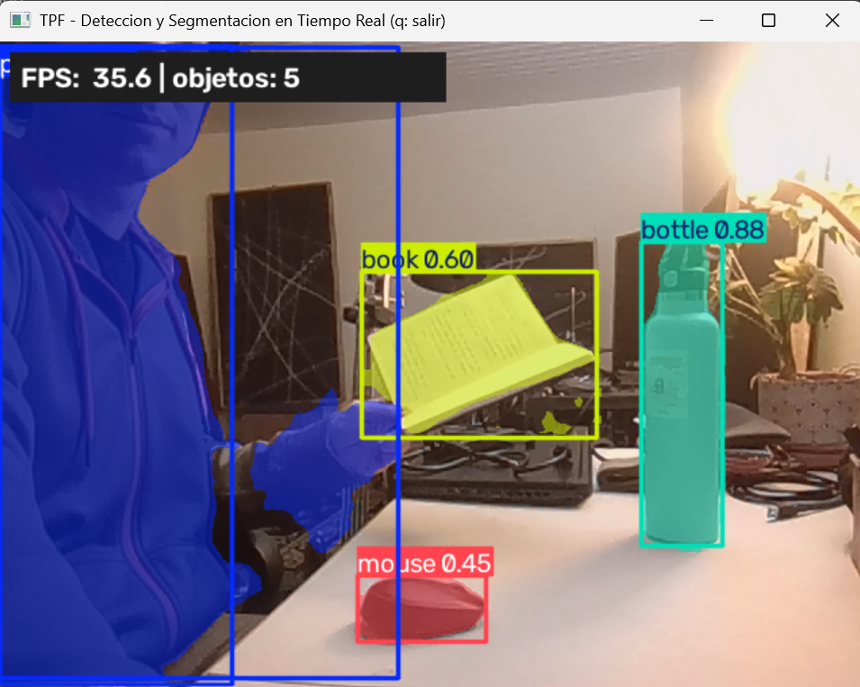

# Real-Time Instance Segmentation on CPU — YOLOv8n-seg + OpenVINO

Real-time object detection and **instance segmentation** running at **35 FPS on a laptop CPU
with no GPU**, built end to end: dataset curation → fine-tuning → evaluation → inference
optimisation → live demo → cloud deployment.

**[▶ Try the live demo](https://huggingface.co/spaces/fedemoranf/TPF-DeepLearning-FedericoMoran)**
— runs in the browser, nothing to download.



---

## Results

**Inference speed** — the same weights, three targets:

| Runtime | Hardware | FPS |
|---|---|---:|
| PyTorch | Intel Core Ultra 5 CPU (no GPU) | 17 |
| **OpenVINO** | Intel Core Ultra 5 CPU (no GPU) | **35** |
| PyTorch | NVIDIA RTX 5090 | ~198 |

Exporting to OpenVINO **doubled throughput on the target device** without touching the
weights. That is what made a genuinely real-time webcam demo possible on a machine with no
discrete GPU.

**Accuracy** — mAP@50-95, fine-tuned model vs. the pretrained `yolov8n-seg` baseline,
evaluated on COCO **val2017** (unseen by both models):

| Model | Boxes | Masks |
|---|---:|---:|
| Pretrained baseline | 0.329 | 0.277 |
| Fine-tuned (8 classes) | 0.275 | 0.236 |

**The fine-tuning did not beat the baseline on accuracy, and this README says so.** What it
bought was specialisation: the model only ever predicts the 8 target classes, so it does not
fire on out-of-vocabulary objects. Section *"What this project is really about"* below
explains why the comparison looks different from what a naive test split would suggest.

---

## The task

Detection and instance segmentation of 8 desk/home object classes from COCO 2017 —
`person`, `cell phone`, `cup`, `bottle`, `laptop`, `keyboard`, `mouse`, `book` — chosen so
that every class can be held up to a webcam during a live demo.

- **Model:** YOLOv8n-seg, fine-tuned with the backbone frozen (`freeze=10`), 150 epochs with
  early stopping (`patience=50`, stopped at 140).
- **Data:** 5,000 COCO 2017 images, split 3,000 / 750 / 1,250 (train / val / test).
- **Metrics:** mAP@50 and mAP@50-95 for both boxes and masks, plus confusion matrix.

---

## What this project is really about

The metrics above are the least interesting part. Three engineering findings mattered more:

### 1. A data leakage defect — found, fixed, and guarded against

FiftyOne tags every downloaded sample with its *source* split (`train`, since the images come
from COCO train2017). That tag collided with the project's own partition tags, so
`match_tags('train')` returned all 5,000 images instead of the intended 3,000 — **the model
was training on its own validation and test data**.

Worse, the YOLO exporter *merges* by default with whatever is already in the target
directory, so image counts looked correct at the tag level while the trainer read something
else off disk.

The tell was a single inconsistent line in the Ultralytics log: `train: Scanning ... 5000
images` where 3,000 was expected.

**Fix:** untag before splitting, wipe the export directory first, and add **file-level
assertions** that verify the exported partitions are disjoint and sized 3,000 / 750 / 1,250 —
checking what the trainer actually reads, not what the metadata claims. The training notebook
aborts if the count is wrong. The pipeline now fails loudly instead of silently.

### 2. The baseline comparison was unfair — and the fix changed the conclusion

Comparing the fine-tuned model against the pretrained baseline on the project's own test
split **favours the baseline**: `yolov8n-seg.pt` was pretrained on COCO train2017, the same
pool the test split came from. The baseline had already seen those test images.

Rebuilding the evaluation on COCO **val2017** — official, disjoint from train2017, unseen by
either model:

| Mask mAP@50-95 | In-house test split | val2017 (fair) |
|---|---:|---:|
| Pretrained baseline | 0.342 | **0.277** |
| Fine-tuned | 0.246 | 0.236 |

The baseline drops by 0.065; the fine-tuned model barely moves. **Two thirds of the
baseline's apparent advantage was leakage from its own pretraining.**

### 3. A silently reinitialised classification head

Reducing the vocabulary from 80 classes to 8 makes Ultralytics **reinitialise** the
classification branch of the head — `Transferred 381/417 items`, i.e. 36 tensors and roughly
372,000 parameters starting from scratch. Full fine-tuning that head on only 3,000 images
made the model *worse* than the pretrained one.

**Fix:** freeze the backbone to preserve the COCO representations and concentrate training on
the neck and head. The full fine-tuning run is kept as an ablation
(`models/yolov8n_seg_full_ft.pt`).

---

## Pipeline

```
notebooks/01_dataset.ipynb      COCO subset download, EDA, partitioning, YOLO export
notebooks/02_entrenamiento.ipynb  Augmentation + fine-tuning (GPU)
notebooks/03_evaluacion.ipynb   mAP/IoU on test, confusion matrix, fair val2017 evaluation
src/export_openvino.py          Export trained weights to OpenVINO
src/demo_webcam.py              Real-time webcam/video inference with on-screen FPS
```

Training ran on an RTX 5090 server (~15–30 min); the real-time demo runs on a laptop CPU.

## Running it

```bash
pip install -r requirements.txt

# Real-time demo (press q to quit)
python src/demo_webcam.py

# Optimised for Intel CPU — roughly 2x the frame rate
python src/export_openvino.py
python src/demo_webcam.py --model models/yolov8n_seg_best_openvino_model

# Lower the inference resolution if the frame rate is tight
python src/demo_webcam.py --imgsz 480
```

## Repository layout

| Path | Contents |
|---|---|
| `notebooks/` | The three pipeline stages, executed with outputs |
| `src/` | Real-time demo and OpenVINO export |
| `models/` | Trained weights (`yolov8n_seg_best.pt`) + OpenVINO model + ablation run |
| `reporte/` | Technical report (19 pages, PDF) and its figures |
| `presentacion/` | Slide deck (34 slides, PDF) |
| `runs/` | Training curves, confusion matrices and evaluation outputs |
| `README_entrega_academica.md` | Original academic submission README (Spanish) |

## Stack

Python · PyTorch · Ultralytics YOLOv8 · OpenVINO · OpenCV · FiftyOne · NumPy · Matplotlib ·
Gradio / Hugging Face Spaces · LaTeX

---

## Notes

- Built as the final project for the Deep Learning course of an **MSc in Artificial
  Intelligence** (National University of Asunción).
- **The technical report and slide deck are in Spanish**; this README, the code and the
  commit history are the English-language entry point.
- The only way to genuinely beat the pretrained baseline here would be training on
  target-domain data (actual webcam imagery), not on more COCO — more COCO is the same
  distribution the baseline already learned from. That, plus INT8 quantisation and tiling for
  small instances, is documented as future work in the report.

**Author:** Federico D. Morán Fretes ·
[LinkedIn](https://www.linkedin.com/in/federico-mor%C3%A1n-a9b95a231/) ·
[GitHub](https://github.com/fedemoranf-alt)
